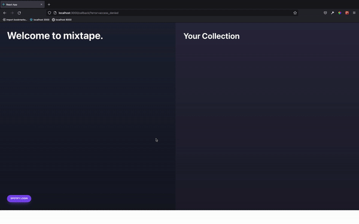
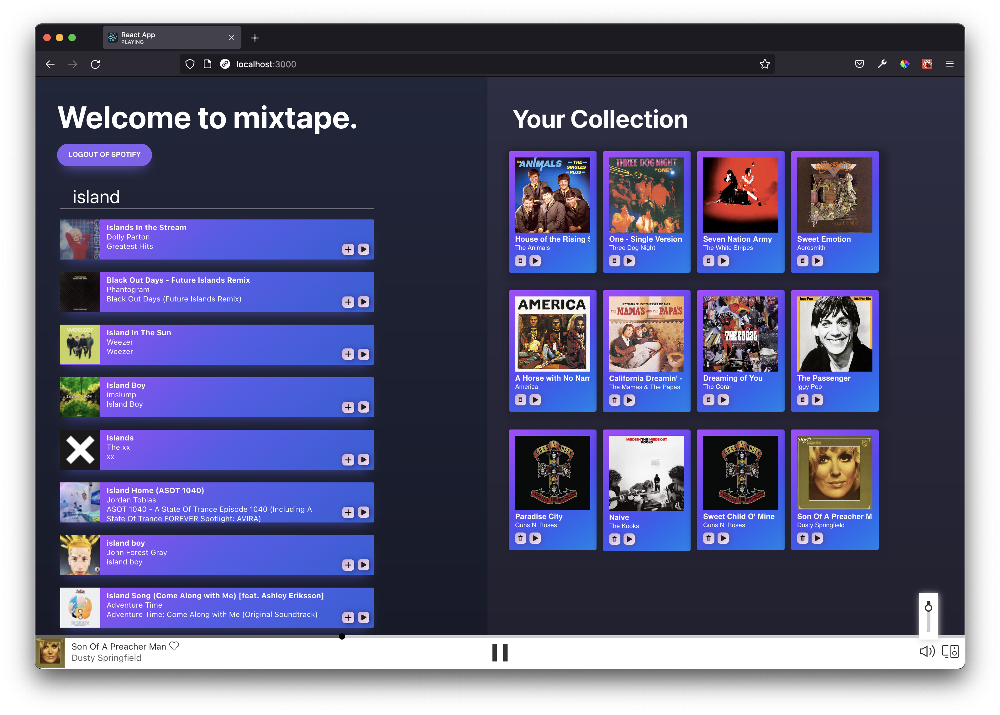
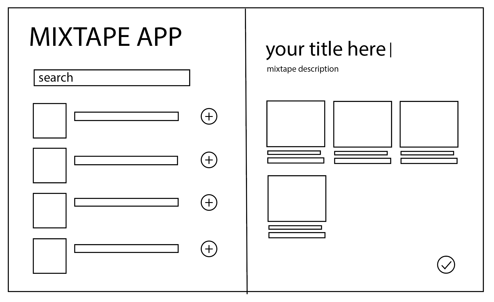
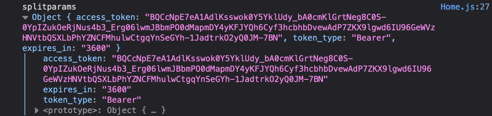
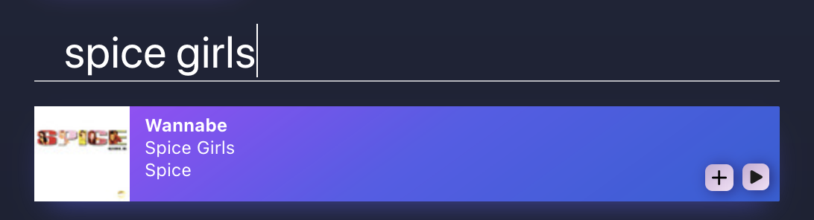

# Project 2: Mixtape

## Overview
This was the second project on the General Assembly course. As a pair we were drawn to the idea of using the Spotify API to create a mixtape app in which we could search for tracks or artists and display them in a playlist format. This would essentially be a simplified Spotify clone with an alternative UI.

Teammate: [Preston Ng](https://github.com/sungchun)

Timeframe: 3 days

## Brief

Create a working React App that consumes a public API and visually presents the API data. It should have several components and can have a router to include several pages.

## Demo

This project could not be deployed due to Spotify’s API restrictions, however [here](https://vimeo.com/manage/videos/668002771) is a demo of the application on Vimeo.





## Technologies
- JavaScript
- React
- CSS
- HTML
- Axios
- Yarn
- Postman
- Git
- GitHub
- Spotify API
- Spotify Web Playback API

## Getting Started
To run the app on your machine you will need to:
- Create a [Spotify developers account](https://developer.spotify.com/documentation/web-api/) and access the Client ID from the Spotify dashboard. 
- Then add localhost:3000 (or other host address) to the list of accepted redirect URIs on the dashboard.

Run yarn add to install the necessary dependencies .

Run yarn start to launch the app in your browser.

For more information on the Spotify API and developer mode:
- [Implicit Grant Flow Authorization](https://developer.spotify.com/documentation/general/guides/authorization/implicit-grant/)
- [Web Playback SDK](https://developer.spotify.com/documentation/web-playback-sdk/guide/)
- [Example of API endpoint (GET track)](https://developer.spotify.com/documentation/web-api/reference/#/operations/get-track)


## Approach
### Planning
To make the most of the time we had for this hackathon we first planned out our application’s functionality and layout. 

#### MVP
MVP:
- Search for tracks
- Display each track in a list
- Be able to add and remove tracks

Given we were using the Spotify API, which uses OAuth 2.0 authentication, our project idea would already be quite ambitious for a 3-day deadline. Therefore, we reserved some extra features for if we completed the MVP.

#### Additional features
- Audio playback of each song
- Customisable heading and description for the mixtape
- Sharing function to send the playlist to a friend

#### Wireframe



### Spotify API
The first step in connecting to the Spotify API was to register the app. This provided me with a dashboard where I could see the app details and edit the user access of the app. As the app is in development mode, only 25 registered users can be authenticated and use the application.

The next and most important step for getting started with the project was to read the Spotify Web API Documentation. This provided us with a lot of details but still required some further research, especially with the type of authentication we would be using.

Spotify implements the OAuth2.0 authorization framework which defines four grant types (or flows) to request and get an access token. The type that we chose to implement was [Implicit Grant](https://developer.spotify.com/documentation/general/guides/authorization/implicit-grant/), as it has the simplest flow and does not require a secret key.


### OAuth2.0 Authentication
Key notes on OAuth2.0 from our research:
- Logging in to the API provides a new access token every time and all calls to the API need this access token.
- The access token, token type, and expiry are all given in the URL.
- The URL must be deconstructed and information must then be passed into an object as key value pairs.
- The key value pairs, particularly the access token, can be stored in local storage so that the user can make requests to the API whenever they are on the site.

With this information, we were able to split the URL into its segments:
```
   function getSpotifyParams(hash) {
       const urlString = hash.substring(1)
       const relevantParams = urlString.split('&')
       const splitParams = relevantParams.reduce((accumulate, currentValue) => {
           const [key, value] = currentValue.split('=')
           accumulate[key] = value
           return accumulate
       }, {})
       return splitParams
   }
```

This was the output:



The values were then saved to local storage where they could later be accessed.

```
export const setAccessToken = (accessToken) => {
   localStorage.setItem('accessToken', accessToken)
}
export const setTokenType = (tokenType) => {
   localStorage.setItem('tokenType', tokenType)
}
export const setExpiry = (expiry) => {
   localStorage.setItem('expiresIn', expiry)
}
export const removeAccessToken = () => {
   localStorage.removeItem('accessToken')
}
```

### Consuming the API
To allow the user to search for songs, we created a form input and passed in the search value in order to make a request.



```
const Request = ({ userSongs, setUserSongs, setPlayID }) => {
   const musicEndpoint = `https://api.spotify.com/v1/search?q=`
   const [trackData, setTrackData] = useState([])
   const [search, setSearch] = useState('')
 
   const handleGetMusic = (event) => {
       event.preventDefault()
       axios.get(`${musicEndpoint}${search}&type=track`, {
           headers: {
               Authorization: `Bearer ${localStorage.getItem('accessToken')}`,
           },
       })
           .then((response) => {
               const listOfTracks = response.data.tracks.items.map((track) => {
                   return {
                       track_id: track.id,
                       artist_name: track.artists[0].name,
                       track_name: track.name,
                       album_art: track.album.images[2],
                       album_art_bigger: track.album.images[1],
                       album_name: track.album.name
                   }
               })
               console.log(listOfTracks)
               setTrackData(listOfTracks)
           })
           .catch((err) => {
               console.error('error fetching music', err)
           })
   }
```

To then show the results of the search we set the list of returned songs as a state and iterated through the list, creating a card for each track by passing through object properties to the ‘SongCard’ component. Each card therefore includes information of the track, such as the name and artist, as well as a ‘add’ and ‘play’ button.

The ‘add’ button adds the track to the playlist. It does this by passing the relevant properties (i.e. name, artist, album) into the Mixtape component and passing in those values as props to the MixtapeCard component which in turn creates new cards for each track added to the playlist.

### Web Playback
The ability to actually play each track in the browser was not something that could be done with the same Spotify API, but involved another package, [react-spotify-web-playback](https://www.npmjs.com/package/react-spotify-web-playback). With this, we were able to implement a Spotify player which played the track requester using the Spotify API. 

The ‘play’ button on each track sets the playID state to the ID of the selected track, which is then used in the Spotify Player URI.

```
function handlePlay() {
       console.log(track_id)
       setPlayID([`spotify:track:${track_id}`])
   }
```

```
<SpotifyWebPlayer
               token={localStorage.getItem('accessToken')}
               uris={playID}
               showSaveIcon
               callback={state => {
                   if (!state.isPlaying) {
                       setPlaying(false)
                   }
               }}
               play={playing}
               initialVolume={0.5}
               autoPlay={false}
           />
```

A useEffect on the Player component with the PlayID sets a boolean state, ‘playing’ to true, which plays the song in the browser.

## Wins
- Styling: Although the authentication of the app took a long time to code and did not leave much time for styling, I was very happy with the slick, vibrant style of the application.
- Teamwork: This was my first ever pair-coding project and it was a major win. Me and Preston were always in sync, from what features we wanted to include, to the idea of the app itself.

## Challenges
The main challenge in this project was understanding OAuth2.0 as the content of the course so far had only covered basic authentication and so navigating documentation of a more complex authentication process was a large task for a 2-3 day project. Writing the correct code in order to properly deconstruct the URL and pass the information into a request was the crux of the app and in overcoming that challenge, the rest of the application came naturally.
Another challenge was the Spotify Player as it would throw an error if there was no access token available. Therefore it had to only be rendered when a token was present (i.e after a successful login).

## Future Features
One interesting feature that we had planned on but were not able to complete within the time restrictions was a ‘share’ feature. This would potentially allow the user to send the playlist, either as a link to another page or an image, to a friend to keep.
One issue in creating Mixtape was that the user would need to log in again after each hour as the token would expire. A feature to rectify this would be to automatically refresh the access token to eliminate the need to keep logging after extended use.

## Key Learnings
My key learning from this project is how to navigate complex API documentation, as well as being resourceful by using additional react packages that would improve the flow of the code.
I also learned to manage time and set soft deadlines in order to meet our MVP. This was particularly important as the authorisation process was completely new to us and so we did not know how long it would take us as a pair to learn and implement it.
